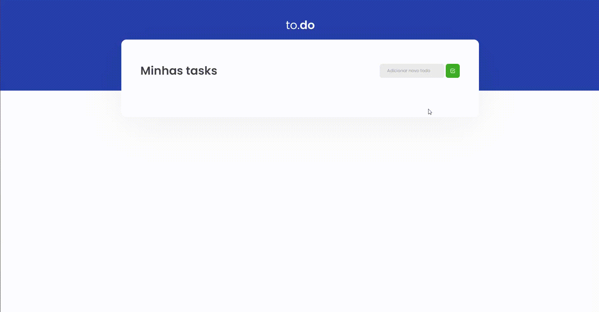

<p align="center">
  <a href="#-tecnologias">Tecnologias</a>&nbsp;&nbsp;&nbsp;|&nbsp;&nbsp;&nbsp;
  <a href="#-preview">Preview</a>&nbsp;&nbsp;&nbsp;|&nbsp;&nbsp;&nbsp;
  <a href="#-getting-started">Getting started</a>&nbsp;&nbsp;&nbsp;|&nbsp;&nbsp;&nbsp;
  <a href="#-projeto">Projeto</a>&nbsp;&nbsp;&nbsp;|&nbsp;&nbsp;&nbsp;
  <a href="#-template">Template</a>
</p>

## 🧪 Tecnologias

Este projeto utiliza as seguintes tecnologias:

- [React](https://reactjs.org)
- [TypeScript](https://www.typescriptlang.org/)
- [SASS](https://sass-lang.com/)

## 🔥 Preview

<br>

<p align="center">
  <a href="https://todo-vf.netlify.app/" target="_blank">
    
  </a>
</p>

## 🚀 Getting started

Clone o projeto e acesse a pasta

```bash
$ git clone https://github.com/Vitor-Franco/01-01-conceitos-reactjs.git && cd 01-01-conceitos-reactjs
```

Siga o passo-passo abaixo.

```bash
# Instale as dependências
$ yarn
# Start o projeto
$ yarn dev
```

## 📝 Projeto

#### Desafio da trilha de ReactJS.

Como projeto inicial do Bootcamp, o desafio era fazer as funcionalidades de uma Todo List em ReactJS.
Assim, listando todas as suas tarefas, removendo-as e finalizando-as.

Projeto desenvolvido durante Bootcamp Ignite da [@Rocketseat](https://github.com/Rocketseat).

## 🖥 Template

Você pode acessar o template do desafio em:

- [Template Challenge](https://github.com/rocketseat-education/ignite-template-reactjs-conceitos-do-react)

---

<p align="center">Made with 💜 by Vitor Franco</p>
